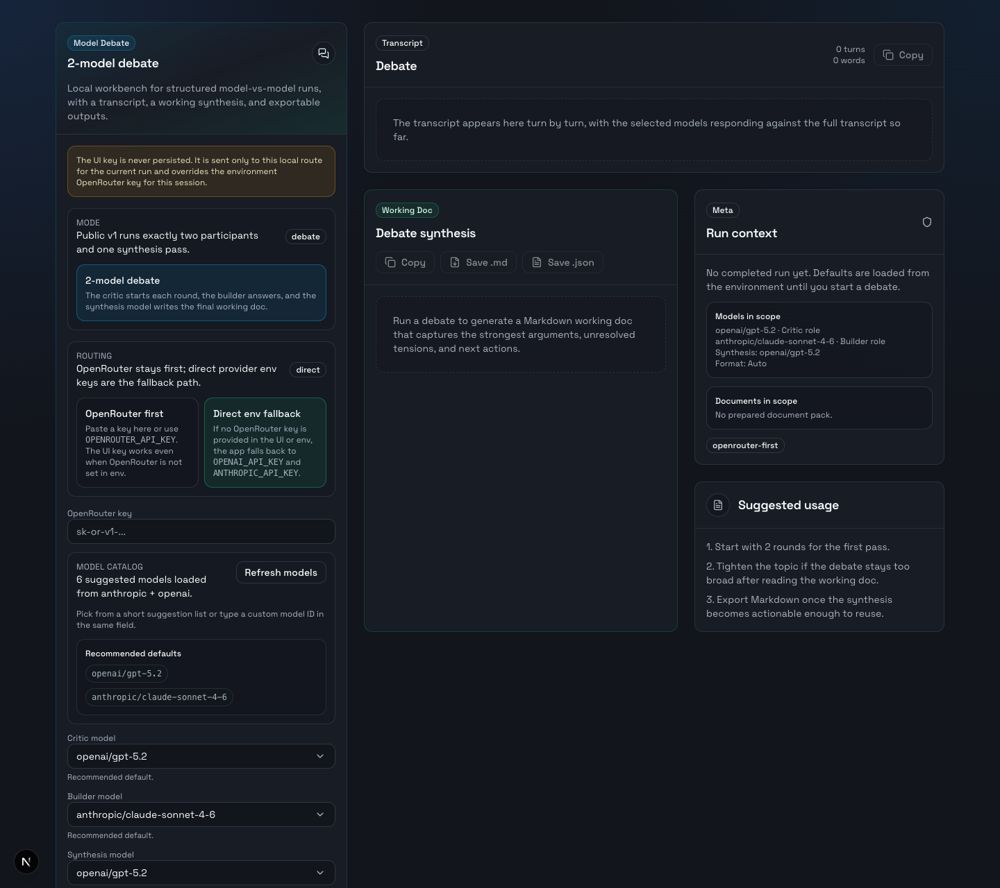
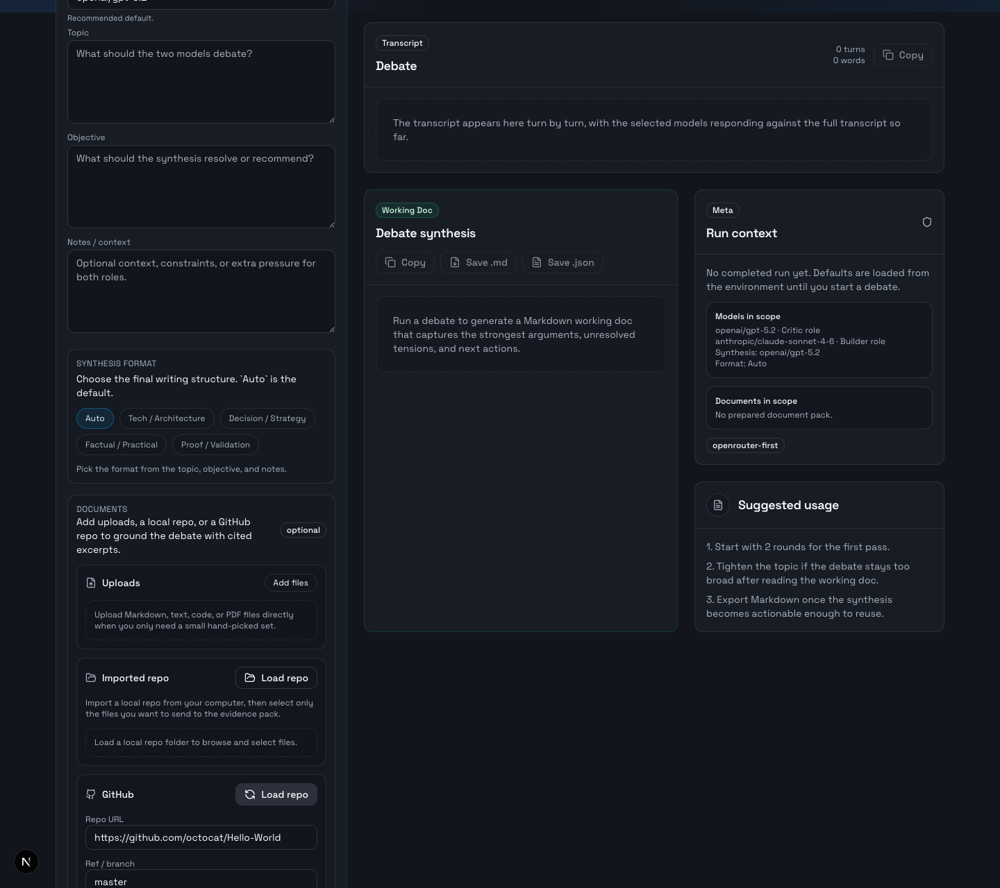
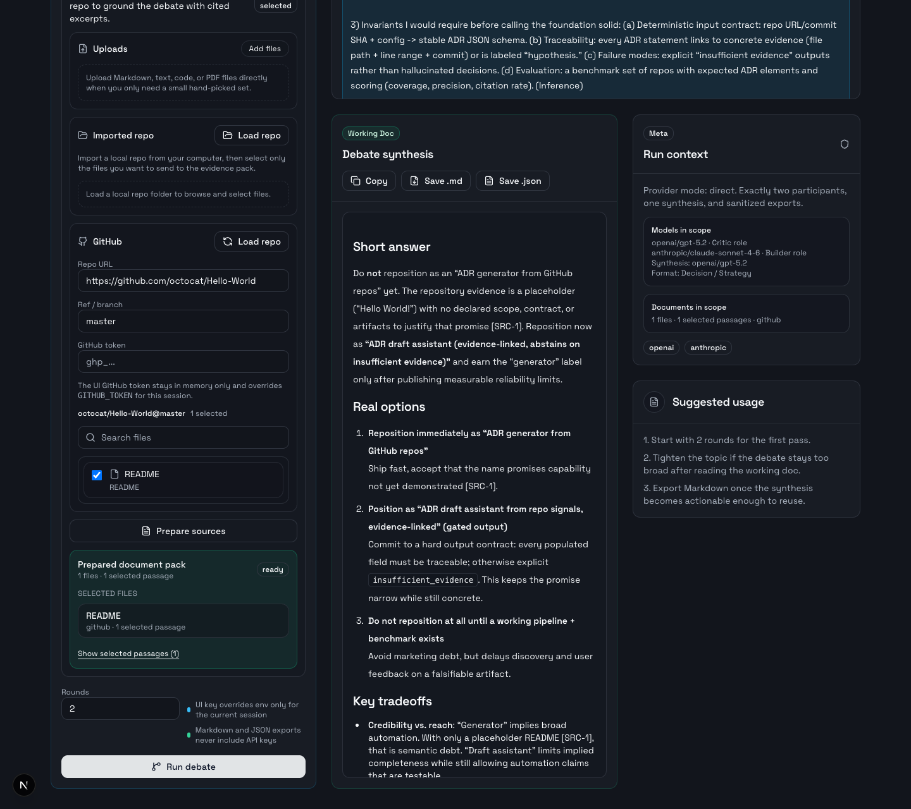

# Model Debate

Model Debate is a source-grounded decision workbench for engineering teams.

The strongest use case is simple:

- select files from a local repo or a private GitHub repo
- run a structured two-model debate on top of that evidence
- export a shareable Markdown decision memo

The product is best framed as:

- ADR drafting from a private GitHub repo
- architecture and design review preparation
- source-backed technical recommendation writing

It is not meant to be a generic chat UI or a fully autonomous coding agent.

## Screenshots

Overview of the workbench:



Browsing a GitHub repository and selecting source files:



Prepared evidence pack plus completed decision memo:



The screenshots use a public demo repository (`octocat/Hello-World`) so the flow is visible without exposing private code or tokens.

## What It Does

Model Debate runs one opinionated workflow:

- a `critic` opens each round by pressure-testing the thesis, fragilities, and invariants
- a `builder` answers with implementation choices, sequencing, and safeguards
- both participants receive the full transcript so far at every turn
- the final output is a structured synthesis, not a chat recap
- selected source files can be resolved into excerpt packs and cited with `[SRC-x]` markers

## Why This Exists

Plain chat is easy, but technical decisions often need three things at once:

- tension instead of premature consensus
- explicit grounding in code or documents
- an exportable memo that can be reused in a review, ADR, RFC, or handoff

Model Debate is built around that narrower workflow rather than around open-ended conversation.

## Current Scope

The product scope is intentionally narrow:

- exactly 2 debate participants
- strict alternating rounds
- one final synthesis pass
- transcript + Markdown/JSON export
- optional document-backed evidence packs from uploads, a local repo, or GitHub
- format-based synthesis:

  - `Auto`
  - `Tech / Architecture`
  - `Decision / Strategy`
  - `Factual / Practical`
  - `Proof / Validation`

## Evidence Pack Support

Model Debate can now prepare a document evidence pack before the debate starts.

- Upload local files directly in the UI
- Import a local repo folder and select files from its tree
- Load and browse public or private GitHub repositories
- Resolve the selected files into a scored excerpt pack
- Inject those excerpts into the debate and synthesis prompts
- Require inline source markers like `[SRC-1]` when the models rely on the evidence pack

If no sources are selected, the app behaves exactly like the original v1 flow.

## Product Scope

- One mode only: 2-model debate
- No personas, presets, snapshots, or alternate run modes
- No database or long-term persistence
- No `localStorage` for API keys or GitHub tokens
- No repository-specific loaders outside the explicit source selectors

## Stack

- Next.js App Router
- TypeScript
- React
- Tailwind CSS
- OpenRouter, OpenAI, Anthropic adapters
- `unpdf` for PDF text extraction

## Architecture

```text
app/
  api/debate/route.ts
  api/models/route.ts
  api/sources/workspace/route.ts
  api/sources/github/tree/route.ts
  api/sources/resolve/route.ts
components/
  debate-workbench.tsx
  source-pack-preview.tsx
  source-tree-browser.tsx
lib/
  exports.ts
  prompts.ts
  providers/
  server/
    debate-runner.ts
    env.ts
    provider-resolution.ts
    source-common.ts
    source-resolver.ts
    source-tree.ts
  types.ts
scripts/
  test-models.mjs
  test-sources.mjs
```

## Getting Started

### 1. Install dependencies

```bash
npm install
```

### 2. Create a local env file

```bash
cp .env.example .env.local
```

### 3. Configure one of the supported auth paths

Option A: OpenRouter-first

```dotenv
OPENROUTER_API_KEY=your_openrouter_key
OPENAI_API_KEY=
ANTHROPIC_API_KEY=
GITHUB_TOKEN=
LOCAL_REPO_BASE_DIR=
DEFAULT_PARTICIPANT_A_MODEL=anthropic/claude-sonnet-4-6
DEFAULT_PARTICIPANT_B_MODEL=openai/gpt-5.2
DEFAULT_SYNTHESIS_MODEL=openai/gpt-5.2
```

Option B: Direct provider keys

```dotenv
OPENROUTER_API_KEY=
OPENAI_API_KEY=your_openai_key
ANTHROPIC_API_KEY=your_anthropic_key
GITHUB_TOKEN=
LOCAL_REPO_BASE_DIR=
DEFAULT_PARTICIPANT_A_MODEL=anthropic/claude-sonnet-4-6
DEFAULT_PARTICIPANT_B_MODEL=openai/gpt-5.2
DEFAULT_SYNTHESIS_MODEL=openai/gpt-5.2
```

### 4. Start the app

```bash
npm run dev
```

Open [http://localhost:3000](http://localhost:3000).

## Environment Variables

| Variable | Required | Description |
| --- | --- | --- |
| `OPENROUTER_API_KEY` | No | Preferred single-key path for mixed-provider debates |
| `OPENAI_API_KEY` | No | Used in direct mode for OpenAI models |
| `ANTHROPIC_API_KEY` | No | Used in direct mode for Anthropic models |
| `GITHUB_TOKEN` | No | Optional PAT for private GitHub trees and file loading |
| `LOCAL_REPO_BASE_DIR` | No | Restricts which local repo paths the server will browse |
| `DEFAULT_PARTICIPANT_A_MODEL` | No | Default critic model value |
| `DEFAULT_PARTICIPANT_B_MODEL` | No | Default builder model value |
| `DEFAULT_SYNTHESIS_MODEL` | No | Default synthesis model |

Code fallbacks:

- `Critic model`: `anthropic/claude-sonnet-4-6`
- `Builder model`: `openai/gpt-5.2`
- `Synthesis model`: `openai/gpt-5.2`
- `Rounds`: `2`
- `LOCAL_REPO_BASE_DIR`: two levels above the app repo root when not explicitly set

## Provider Resolution

Credential resolution order:

1. OpenRouter API key entered in the UI for the current browser session
2. `OPENROUTER_API_KEY` from the environment
3. Direct provider routing with `OPENAI_API_KEY` and `ANTHROPIC_API_KEY`

Direct routing is model-driven:

- `openai/...` routes to OpenAI
- `anthropic/...` routes to Anthropic

GitHub token resolution order:

1. GitHub token entered in the UI for the current browser session
2. `GITHUB_TOKEN` from the environment

## Model Selection

- `Critic model` and `Builder model` are role slots, not provider slots
- both role slots can use any compatible model ID
- `Synthesis model` can use either provider
- Custom model IDs are still allowed
- The suggestion menus are based on live provider catalogs, not a static hardcoded list

## Source Resolution

Supported inputs:

- uploads
- local repo files
- GitHub repository files

Supported file types in v1.1:

- text
- code
- PDF text extraction

Not supported:

- DOCX
- OCR
- images
- arbitrary local paths outside `LOCAL_REPO_BASE_DIR`

Default limits:

- maximum `20` selected files per run
- maximum `3` excerpts per source
- maximum `18` excerpts in the final pack
- text/code files up to `2 MB`
- PDF files up to `10 MB`

Ignored paths:

- `node_modules`
- `.git`
- `.next`
- `dist`
- `build`
- `coverage`
- env/key-like files
- obvious minified assets

## Security Model

- OpenRouter, OpenAI, Anthropic, and GitHub tokens stay in React state or environment variables only
- No secrets are stored in `localStorage`
- Exports never include provider keys or GitHub tokens
- Source packs contain only sanitized file metadata and resolved excerpts
- The app is designed to avoid logging secrets

## Run Flow

1. Choose models, topic, objective, notes, and rounds
2. Choose a synthesis format, or leave it on `Auto`
3. Optionally select uploads, local repo files, and/or GitHub files
4. Click `Prepare sources`
5. Review the prepared evidence pack preview
6. Run the debate
7. Review transcript + synthesis
8. Export Markdown or JSON

If sources are selected, the app expects you to prepare them before the debate starts.

## API

### `POST /api/debate`

Runs the debate and final synthesis.

Request body:

```json
{
  "topic": "Should early-stage teams prefer monoliths over microservices?",
  "objective": "Produce a concrete recommendation for an early-stage engineering team.",
  "notes": "Pressure-test the invariants and the delivery sequence.",
  "synthesisFormat": "decision_strategy",
  "rounds": 2,
  "participantA": {
    "displayName": "Critic",
    "modelId": "anthropic/claude-sonnet-4-6",
    "rolePreset": "critic"
  },
  "participantB": {
    "displayName": "Builder",
    "modelId": "openai/gpt-5.2",
    "rolePreset": "builder"
  },
  "synthesisModel": "openai/gpt-5.2",
  "apiKey": "optional_openrouter_key",
  "sourcePack": {
    "files": [],
    "excerpts": [],
    "warnings": []
  }
}
```

### `POST /api/models`

Loads the model catalog for the current credential context.

### `POST /api/sources/workspace`

Loads the browseable file tree for a selected local repo path.

Request body:

```json
{
  "repoPath": "/path/to/your/repo"
}
```

### `POST /api/sources/github/tree`

Request body:

```json
{
  "repoUrl": "https://github.com/vercel/next.js",
  "ref": "canary",
  "githubToken": "optional_ui_token"
}
```

### `POST /api/sources/resolve`

Accepts `multipart/form-data` with:

- `manifest`: JSON string
- `githubToken`: optional string
- `files`: zero or more uploaded files

Example manifest:

```json
{
  "topic": "Debate the strongest architecture direction",
  "objective": "Produce a recommendation grounded in the selected documents.",
  "localRepoPath": "/path/to/your/repo",
  "workspacePaths": ["README.md", "app/page.tsx"],
  "githubSelection": {
    "repoUrl": "https://github.com/vercel/next.js",
    "ref": "canary",
    "paths": ["README.md"]
  }
}
```

## Exports

Markdown export includes:

- topic
- objective
- selected synthesis format
- effective models
- synthesis
- source manifest
- prepared excerpts
- source warnings

JSON export includes:

- versioned export payload
- settings used for the run
- sanitized source pack
- full transcript in the result payload
- debate result metadata

## Smoke Tests

Model catalog smoke test:

```bash
npm run test:models
```

Source endpoint smoke test:

```bash
npm run dev
npm run test:sources
```

Optional env overrides for the source smoke test:

- `APP_BASE_URL`
- `TEST_LOCAL_REPO_PATH`
- `TEST_GITHUB_REPO_URL`
- `TEST_GITHUB_REF`

## License

MIT. See [LICENSE](LICENSE).
